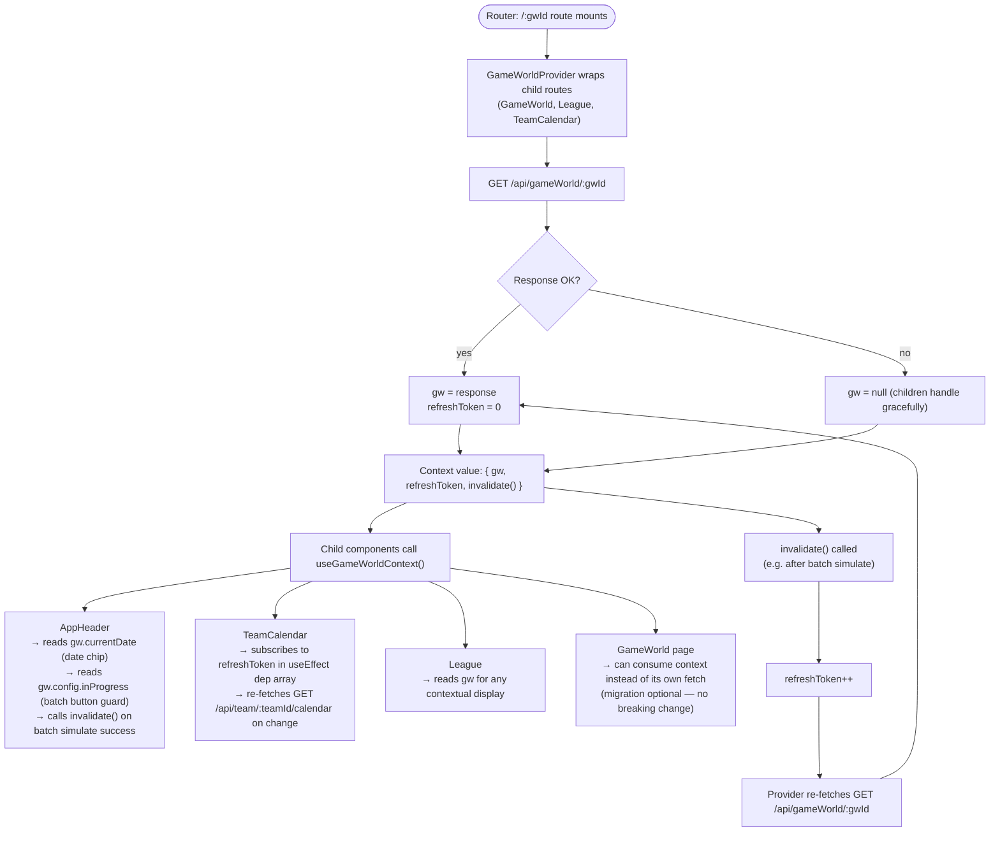

> Superseded by docs/high-level-design.md and docs/llds/simulate-game-ui.md as of LID backfill.

# Use Case Design: Simulate Game UI

## Step 1 — Use Case Summary

The player triggers simulation of one or more scheduled games from the React frontend. Three coordinated UI flows are required: a shared `GameWorldProvider` (React Context) that owns `GameWorld` state and a `refreshToken` for cross-component invalidation, a shared `AppHeader` component rendered on all `gwId`-scoped pages that displays `currentDate` and hosts the batch "Simulate Today" action, and a per-row simulate action on the `TeamCalendar` `GameRow` that patches results in-place.

### Player-Provided Clarifications

1. **Entry points**: Both single-game (per row) and batch (page-level) — each with their own process flow.
2. **Simulation scope**: Both single and batch, with separate flows.
3. **Result display**: Score appears in-place on the game row — no navigation.
4. **GameWorld date**: `currentDate` must be visible in a standard header location across all pages.
5. **Error handling**: Display an error icon inline for now — no retry; revisit later.

### Related Backend Design

The backend simulate-game use case is fully designed and planned:
- Proposal: `docs/architecture/archive/simulate-game-proposal.md`
- Implementation plan: `docs/architecture/archive/simulate-game-plan.md`
- Gherkin tests: `test/bdd/features/simulate-game.feature`

Backend endpoints consumed by this UI:
- `POST /api/game/:gameId/simulate` — single-game
- `POST /api/gameWorld/:gwId/simulate` — batch (body: `{ endDate?: string }`)
- `GET /api/gameWorld/:gwId` — used by date header hook

---

## Step 2 — BPMN Process Flows

Three flows are defined. Flow C (`GameWorldProvider`) is a cross-cutting dependency that both Flow A and Flow B consume.

Existing process flows referenced:
- [`find-game-world.md`](../process-flow/find-game-world.md) — referenced by the `GameWorldProvider` fetch on mount

### Shared Architecture Note

All three flows share a single architectural backbone:

- **`GameWorldProvider`** — wraps all `/:gwId` child routes. Fetches `gw` once (including `currentDate`), exposes `{ gw, refreshToken, invalidate() }` via React Context. `invalidate()` increments `refreshToken` and re-fetches `gw`.
- **`AppHeader`** — a shared component rendered on every `/:gwId` page. Consumes context for `currentDate` display and owns the batch simulate state machine.
- **`refreshToken`** — an integer in context that child pages (e.g. `TeamCalendar`) subscribe to via `useEffect`. When batch simulate completes, `invalidate()` is called → `refreshToken` increments → `TeamCalendar` re-fetches its games automatically, resolving the staleness concern.

---

### Flow A: Simulate Single Game (TeamCalendar)

**Entry point:** `/:gwId/:leagueId/team/:teamId/calendar` — `GameRow` component

```mermaid
flowchart TD
  start([TeamCalendar mounts]) --> fetch["GET /api/team/:teamId/calendar"]
  fetch --> setGames["games = response; simulateState = Map()"]
  setGames --> render["Render GameRow per game"]

  render --> isScheduled{"game.status = SCHEDULED?"}
  isScheduled -->|no| staticDisplay["Display score or status badge"]
  isScheduled -->|yes| rowState{"simulateState[gameId]?"}

  rowState -->|idle| showBtn["Show 'Simulate' button"]
  rowState -->|loading| showSpinner["Show spinner — button disabled"]
  rowState -->|error| showErrIcon["Show error icon ⚠ inline"]

  showBtn --> click["Player clicks Simulate"]
  click --> setLoading["simulateState[gameId] = loading"]
  setLoading --> req["POST /api/game/:gameId/simulate"]

  req --> ok{Response 200?}
  ok -->|yes| updateLocal["Patch games[gameId] in local state\n(homeTeamResult, awayTeamResult, status=COMPLETED)"]
  updateLocal --> showScore["GameRow re-renders: score replaces button"]
  ok -->|no| setErr["simulateState[gameId] = error"]
  setErr --> showErrIcon
```

**Flow notes:**
- `simulateState` is a `Map<gameId, 'idle' | 'loading' | 'error'>` held in `TeamCalendar` state, passed into `GameRow` as a prop alongside the simulate callback.
- On success, `games` local state is patched in-place — no full re-fetch needed for the single-game case.
- Error icon replaces the button and persists until the player navigates away or the calendar re-fetches. No retry for now.
- Only games with `status = SCHEDULED` show the simulate button. `COMPLETED` and `IN_PROGRESS` games show their result or status badge as before.
- `TeamCalendar` subscribes to `refreshToken` from `GameWorldProvider` context. When batch simulate fires (from `AppHeader`), `refreshToken` increments and the calendar's `useEffect` re-fires → full game list re-fetch. This keeps single-game and batch simulate consistent without prop drilling.

---

### Flow B: Simulate Batch (AppHeader — shared across all pages)

**Entry point:** `AppHeader` component — rendered on every `/:gwId` page (`GameWorld`, `League`, `TeamCalendar`)

**Note:** The batch action lives in `AppHeader` rather than any single page, giving the player consistent access on every page without duplicating logic. The backend endpoint `POST /api/gameWorld/:gwId/simulate` is scoped to the game world — no league-specific endpoint is needed for this.

```mermaid
flowchart TD
  start([AppHeader renders]) --> consume["Consume GameWorldProvider context\n{ gw, invalidate }"]
  consume --> guard{"gw.config.inProgress\nAND gw.currentDate set?"}

  guard -->|no| noBtn["No batch simulate button shown"]
  guard -->|yes| showBtn["Show 'Simulate Today' button + currentDate chip"]

  showBtn --> batchState{"batchStatus?"}
  batchState -->|idle| idleBtn["Button enabled"]
  batchState -->|submitting| spinBtn["'Simulating…' — button disabled"]
  batchState -->|success-clean| autoHide["Auto-dismiss after 3s → batchStatus = idle"]
  batchState -->|success-skipped| warningBanner["Warning: Y games could not be simulated\n(persists — blocks Advance Date action in future)"]
  batchState -->|error| errorMsg["Error message + Retry button"]

  idleBtn --> click["Player clicks 'Simulate Today'"]
  click --> setSubmitting["batchStatus = submitting"]
  setSubmitting --> req["POST /api/gameWorld/:gwId/simulate"]

  req --> ok{Response 200?}
  ok -->|yes| checkSkipped{"skipped.length > 0?"}
  checkSkipped -->|no| setClean["batchStatus = success-clean\ncall invalidate()"]
  checkSkipped -->|yes| setSkipped["batchStatus = success-skipped\ncall invalidate()"]
  setClean --> autoHide
  setSkipped --> warningBanner

  ok -->|no| setError["batchStatus = error"]
  setError --> errorMsg
  errorMsg --> retry["Player clicks Retry → setSubmitting"]
```

**Flow notes:**
- `batchStatus` enum: `idle | submitting | success-clean | success-skipped | error`.
- `success-clean` (no skipped games): summary auto-dismisses after ~3 seconds, status resets to `idle`.
- `success-skipped` (some games could not be simulated): warning banner **persists** and will block the future "Advance Date" action until resolved. This is forward-compatible with that upcoming use case.
- `invalidate()` from context is called on any successful response — this increments `refreshToken`, triggering `TeamCalendar` and other subscribers to re-fetch.
- The guard (`inProgress && currentDate`) is evaluated from context data — no extra fetch.
- `gwId` for the API call is read from the React Router `useParams()` hook within `AppHeader`.

---

### Flow C: GameWorldProvider (React Context)

**Entry point:** `/:gwId` route in `routes.tsx` — wraps all child pages



**Flow notes:**
- `GameWorldProvider` is the single source of truth for `gw` within any `/:gwId` session. One fetch, one state, consistent across all pages.
- `refreshToken` is an integer incremented by `invalidate()`. Child components include it in `useEffect` dependency arrays to react to external changes.
- `GameWorld` page currently fetches `gw` independently — it can continue to do so or be migrated to consume context. Either is non-breaking.
- **Date chip position** is TBD — the user wants to see it in action before deciding. The `AppHeader` renders the chip from context; placement within the header element is a styling decision deferred to implementation.
- `useGameWorldContext()` is a simple wrapper around `useContext(GameWorldContext)` with a null-guard for pages rendered outside the provider.

---

### Open Questions — Resolved

1. **Batch action location** → Moved to `AppHeader` — consistent across all `/:gwId` pages. No per-page duplication. Calls the `gwId`-scoped endpoint regardless of which page the player is on. Incorporated into Flow B.

2. **Success state persistence** → Two states:
   - `success-clean` (no skipped games): auto-dismiss after ~3 seconds.
   - `success-skipped` (some games skipped): warning banner persists and will block the future "Advance Date" action. Incorporated into Flow B.

3. **Date chip position** → TBD. Deferred to implementation — player needs to see it in context. `AppHeader` renders it from context; final placement is a styling decision.

### External Review — Resolved

- **Caching Paradox (Flow C)** → Resolved. `useGameWorld` hook replaced with `GameWorldProvider` (React Context). Single fetch per `gwId` session, shared across all consumers. Flow C fully rewritten.

- **Batch Simulation Location** → Resolved. Batch action moved to `AppHeader`, available on every `/:gwId` page. No per-page duplication, no new backend endpoint needed. Flow B fully rewritten.

- **Component Staleness (TeamCalendar)** → Resolved. `refreshToken` in context is incremented by `invalidate()` after any batch simulate. `TeamCalendar` includes `refreshToken` in its `useEffect` dependency array and re-fetches games automatically. Incorporated into Flow A notes and Flow C.

---

## Step 3 — Access Patterns & Component Requirements

### API Access Patterns

| Flow | Step | Operation | Endpoint | New? |
|------|------|-----------|----------|------|
| C | Provider mounts / `invalidate()` | READ | `GET /api/gameWorld/:gwId` | No — existing; new trigger via `invalidate()` |
| A | Calendar mounts / `refreshToken` change | READ | `GET /api/team/:teamId/calendar` | No — existing |
| A | Player clicks Simulate on a `GameRow` | WRITE | `POST /api/game/:gameId/simulate` | No — endpoint exists (needs backend Plan Tasks 4, 8) |
| B | Player clicks Simulate Today in `AppHeader` | WRITE | `POST /api/gameWorld/:gwId/simulate` | **Yes** — new (backend Plan Task 9) |

No new backend endpoints are introduced by this UI use case. The batch endpoint is already specified in the backend simulate-game plan (Task 9).

### New & Modified React Components

| # | Component | File | Change |
|---|-----------|------|--------|
| 1 | `GameWorldProvider` | `src/ui/context/game-world-context.tsx` | **New** |
| 2 | `useGameWorldContext` | `src/ui/context/game-world-context.tsx` | **New** (exported from same file) |
| 3 | `AppHeader` | `src/ui/components/app-header.tsx` | **New** |
| 4 | `routes.tsx` | `src/ui/routes.tsx` | **Modified** — wrap `/:gwId` subtree with provider |
| 5 | `TeamCalendar` | `src/ui/pages/team-calendar.tsx` | **Modified** — `refreshToken` subscription + `simulateState` |
| 6 | `GameRow` | `src/ui/pages/team-calendar.tsx` | **Modified** — simulate button / spinner / error icon |
| 7 | `GameWorld` | `src/ui/pages/game-world.tsx` | **Modified** — consume context; remove own fetch; remove inline header |
| 8 | `League` | `src/ui/pages/league.tsx` | **Modified** — consume context; remove inline header |

### Component Specifications

#### 1 & 2. `GameWorldProvider` + `useGameWorldContext`
```
State:   gw: any | null
         refreshToken: number (starts at 0)
Exposes: { gw, refreshToken, invalidate: () => void }
Fetches: GET /api/gameWorld/:gwId on mount and on each invalidate() call
Location: Wraps all children of the /:gwId route in routes.tsx
```

#### 3. `AppHeader`
```
Props:   backLink: string, backLabel: string
Consumes: useGameWorldContext() → { gw, invalidate }
State:   batchStatus: 'idle' | 'submitting' | 'success-clean' | 'success-skipped' | 'error'
         batchResult: { simulated: any[], skipped: any[] } | null
Renders: — Breadcrumb (← backLabel)
         — currentDate chip (position TBD)
         — 'Simulate Today' button (guard: inProgress && currentDate set)
         — Batch status feedback inline
On success-clean: calls invalidate(); auto-dismiss after ~3s; resets to idle
On success-skipped: calls invalidate(); warning banner persists (forward-compatible
                    with future Advance Date blocking)
```

#### 5 & 6. `TeamCalendar` + `GameRow` changes
```
TeamCalendar new state:
  simulateState: Map<number, 'idle' | 'loading' | 'error'>

TeamCalendar useEffect dep array:
  [gwId, leagueId, teamId, refreshToken]   ← refreshToken added

GameRow new props:
  simulateStatus?: 'idle' | 'loading' | 'error'
  onSimulate?: () => void

GameRow render (when game.status = SCHEDULED):
  idle    → 'Simulate' button
  loading → spinner, button disabled
  error   → ⚠ icon inline (no retry)
```

### GameWorld Page Migration

`GameWorld` page is **fully migrated** to consume `useGameWorldContext()` — the duplicate `GET /api/gameWorld/:gwId` call is removed. This is required (not optional) so the page uses the same `gw` instance as `AppHeader`, keeping `currentDate` chip and batch feedback in sync.

### Data Model Changes
None. This is a pure UI use case — no new database tables, columns, or indexes.

### Backend Dependencies

| Backend Task | Required For |
|---|---|
| Task 1 — `Game.status` field | `GameRow` reads `status = SCHEDULED` to show simulate button |
| Task 4 — Router bug fix | Single-game simulate reaching the correct handler |
| Task 8 — `handlers.simulateGame` update | Single-game simulate returning guarded result |
| Task 9 — Batch endpoint | `AppHeader` batch simulate |

---

## Step 4 — Gherkin Test Cases

Generated and saved to [`test/ui/features/simulate-game-ui.feature`](../../../test/ui/features/simulate-game-ui.feature).

Scenarios covered:

| Category | Count |
|----------|-------|
| Flow C — GameWorldProvider | 5 |
| Flow B — AppHeader date chip | 3 |
| Flow B — Batch button guards | 3 |
| Flow B — Batch simulate happy paths | 4 |
| Flow B — Batch simulate error paths | 3 |
| Flow A — GameRow button guards | 3 |
| Flow A — Single simulate happy paths | 3 |
| Flow A — Single simulate error paths | 2 |
| Cross-flow — Batch → TeamCalendar refresh | 2 |
| **Total** | **28** |
