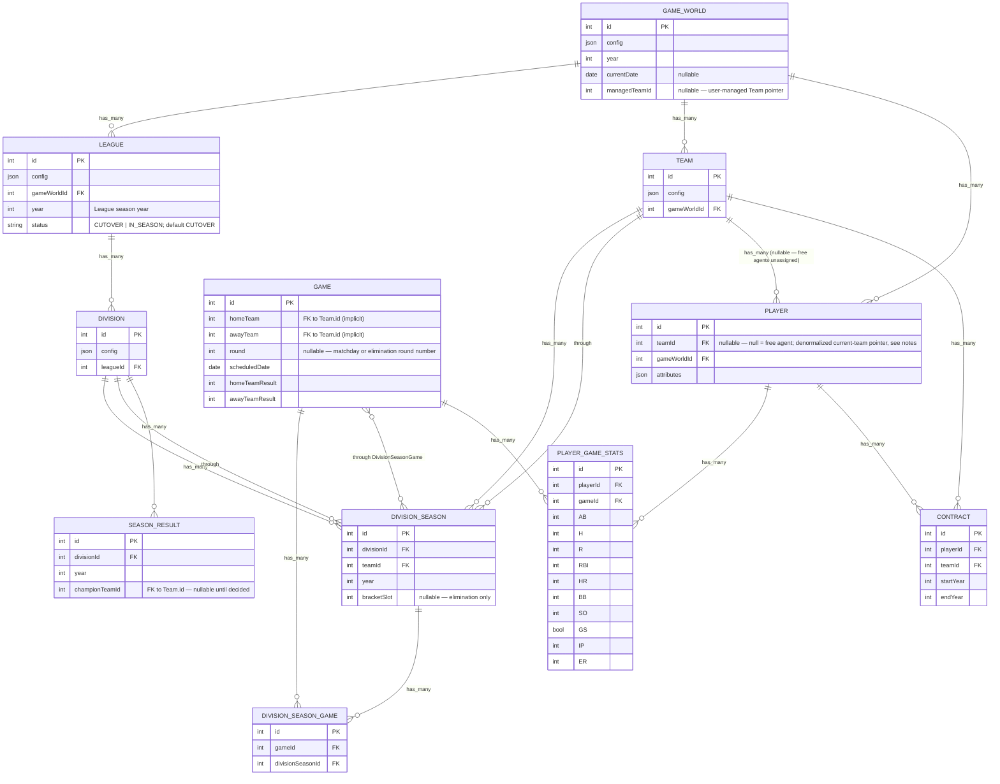

# Data Model (Sequelize)

This diagram is derived from `src/db/model/*.ts` and `src/db/model/associations.ts`.

Notes
- `DivisionSeason` has a unique composite index on `(divisionId, teamId, year)`.
- `League.year` is the League-scoped season year; `League.status` is its lifecycle phase and defaults to `CUTOVER`.
- `GameWorld.managedTeamId` is a nullable, user-managed Team pointer. It is intentionally not a
  database association or an ownership gate yet: `GameWorldFactory.setManagedClub` validates that
  a non-null Team belongs to the same GameWorld before writing it, and `null` means unclaimed.
- `Game.homeTeam` and `Game.awayTeam` are intended FKs to `Team.id` but are not defined as Sequelize associations yet.
- `SeasonResult` (new, [HLD: Full Season Simulation](../../high-level-design.md#hld-full-season-simulation-league--league-cup)) is a general-purpose historical-fact table, not a live-season field — one row per `(divisionId, year)` once that division's season is decided. Populated for `KNOCKOUT` divisions when a round resolves to a single winner, and for the top-tier `ROUND_ROBIN` division when `isSeasonComplete` flips true. It is the single place the UI's champion banner reads from, regardless of competition structure. See `docs/llds/knockout-bracket.md`.
- `Division.config` (JSON) carries a `CompetitionFormat` — a discriminated union on `structure` (`ROUND_ROBIN` | `KNOCKOUT`) that replaces the old flat `GameFormula[]` array; resolved as `divisionConfig.format ?? leagueConfig.format`. See `docs/llds/competition-format.md`. Not modeled as ERD columns since it lives inside the existing `config` JSON blob, not new typed columns.
- `Game.round` (existing, previously matchday-only) and `DivisionSeason.bracketSlot` (existing) are reused as-is for knockout round-advancement — no new `Game`/`DivisionSeason` columns were needed for the bracket redesign. Byes are `Game` rows with `awayTeam: null`, already-`COMPLETED`; tiebreaker games reuse the tied legs' `round` number rather than introducing a new field.
- `Player`, `PlayerGameStats`, `Contract` (new, [HLD: Players, Attributes, Stats & Contracts](../../high-level-design.md#hld-players-attributes-stats--contracts) — **planning-only, not yet implemented**): `Player` is a first-class table scoped per-`GameWorld` (mirrors `Team.gameWorldId`), `teamId` nullable to represent a free agent. `attributes` is a flat non-role-conditioned JSON shape (shared scalar ratings + dense per-position affinity map + per-pitch repertoire) — no stored `position` column; primary position is derived at read-time. `PlayerGameStats` is the only stored stats fact — one row per `(playerId, gameId)`, Core batting + Core pitching columns only; season/career stats are aggregate queries over it, not separate tables, and this table has no writer yet. `Contract` binds one `Player` to one `Team` with `startYear`/`endYear` only (no `value` field); roster size is a flat headcount range (min 20/max 30) enforced only by the generation algorithm, not by schema validation. `Player.teamId` and `Contract` deliberately both encode team membership: `Contract` is the authoritative, historical record (one row per team-tenure, with a term), while `Player.teamId` is a denormalized "current team" pointer kept for query ergonomics (reading a plain FK instead of filtering `Contract` rows to the one covering the current `GameWorld.year`). Initial roster generation writes both together, so they can't drift there; keeping them in sync is an obligation for whichever future map introduces post-generation team changes (transfers/trades), not yet solved by any code path. See `docs/llds/player-attributes.md`, `docs/llds/player-stats.md`, `docs/llds/player-contracts-roster.md`.
