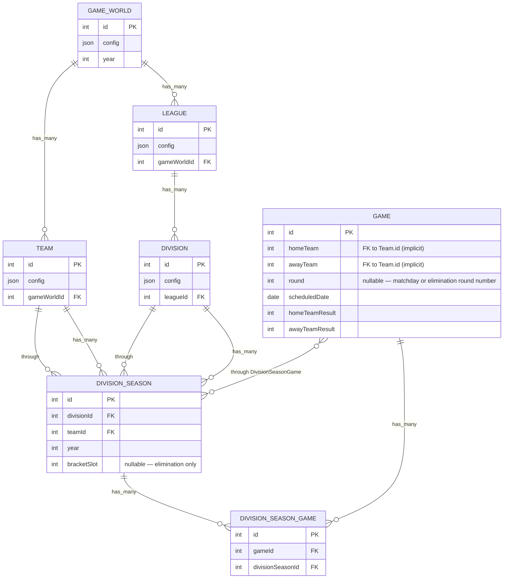

# Data Model (Sequelize)

This diagram is derived from `src/db/model/*.ts` and `src/db/model/associations.ts`.

Notes
- `DivisionSeason` has a unique composite index on `(divisionId, teamId, year)`.
- `Game.homeTeam` and `Game.awayTeam` are intended FKs to `Team.id` but are not defined as Sequelize associations yet.
