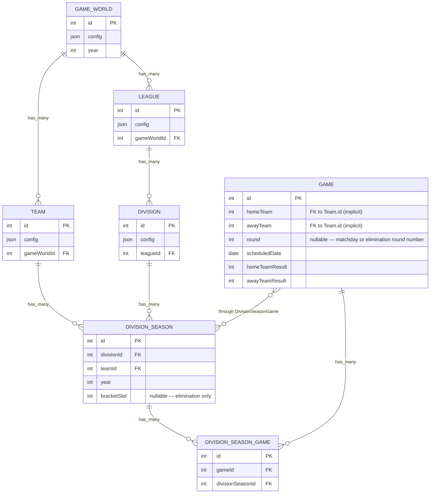

# New Season Schedule — DB & Domain Design

## Architecture Doc Accuracy

The docs in `docs/architecture/` are largely accurate against the current code, with these gaps:

- **`data-model.md`**: Missing `round` field on `Game` (not yet added — needed for scheduling). The suggested migration from `DivisionSeasonGame` to a direct FK on `Game` is documented but not yet implemented; current code still uses the join table.
- **`start-new-season-division.md`**: Accurate at the flow level, but the diagram says "game weeks" without capturing the distinction between table (pre-generate all) vs elimination (generate round by round), and `scheduledDate` is a TODO in code.
- **`check-league-season-complete.md`**: Accurate at the flow level, but `isSeasonComplete()` is currently hardcoded to `return true`.
- **`create-game.md`**: Stub only — no mention of `round` or `scheduledDate` population.
- All other docs are accurate.

---

## Design

### Core distinction: table vs elimination scheduling

**Table (`ROUND_ROBIN`)** — all games can be pre-generated at season start because every fixture is known upfront. Each matchday gets a `round` index; `scheduledDate` is computed as `startDate + round × intervalDays`.

**Elimination (`KNOCKOUT`)** — round 2+ fixtures can't exist until round 1 results are known (you don't know who's advancing). Rounds are generated on demand via an `advanceRound()` call triggered after each round completes. The distinction between `REDRAW` and fixed bracket only affects *pairing logic* within `advanceRound()`, not the overall flow.

### New `SchedulingConfig` type

```typescript
interface SchedulingConfig {
  startDate: string;      // ISO date — when the first round/matchday is played
  intervalDays: number;   // calendar days between consecutive rounds/matchdays
}
```

Added to `DivisionConfig.schedulingConfig?: SchedulingConfig`. When absent, games are created without scheduled dates (existing behaviour preserved).

### Data model additions

| Change | Rationale |
|---|---|
| `Game.round: INTEGER` | Groups games into matchdays/rounds for display, ordering, and "is this round complete?" checks |
| `DivisionSeason.bracketSlot: INTEGER NULLABLE` | Tracks position in a fixed bracket so `advanceRound()` can pair slot-winner N vs slot-winner N+1 without random re-draw |

### Updated data model



### `isSeasonComplete()` — real implementation

Currently stubs `return true`. Real logic: query all `Game` rows linked to this division+year via `DivisionSeasonGame` and check that every game has a non-null `homeTeamResult`. A table division is complete when all matchdays are done; an elimination division is complete when the final round has a result.

### `advanceRound()` — new method on `IDivision`

Preconditions: all games in the current round are complete.

1. Query current-round games for this division season
2. Determine winner per fixture:
   - `ONE_LEG`: higher score wins; exact draw → coin-flip (simulation default)
   - `TWO_LEG`: find the matching return fixture by flipped `homeTeam`/`awayTeam`, sum aggregate; apply coin-flip on aggregate draw (away-goals rule is a future config option)
3. Pair winners for the next round:
   - `REDRAW`: random shuffle of remaining team IDs
   - Fixed bracket (no `REDRAW`): pair by `bracketSlot` of winner — slot 0 winner vs slot 1 winner, slot 2 winner vs slot 3 winner, etc.
4. `bulkCreate` new `Game` rows (round N+1) + `DivisionSeasonGame` links

### What stays the same

- Round-robin generation algorithm in `generateGames()` — just needs `round` index and date stamping bolted on
- `DivisionSeasonGame` join table — no migration yet (that's a separate structural refactor; not in scope here)
- The `newSeason()` call chain: `GameWorld → League → Division`

---

## Task Breakdown

Each task is independently implementable once its prerequisites are met.

---

### T1 — Add `round` to `Game` model
**Files:** `src/db/model/game.ts`, `docs/architecture/data-model/data-model.md`

Add `round: DataTypes.INTEGER` (nullable) to the `Game` Sequelize model definition. Update the data model diagram to include it.

*No prerequisites. Unblocks T4, T7.*

---

### T2 — Add `SchedulingConfig` type + wire into `DivisionConfig`
**Files:** `src/api/models.ts`

```typescript
interface SchedulingConfig {
  startDate: string;
  intervalDays: number;
}
```

Add `schedulingConfig?: SchedulingConfig` to `DivisionConfig`. Export the new type.

*No prerequisites. Unblocks T4, T7.*

---

### T3 — Implement `DivisionFactory.isSeasonComplete()`
**Files:** `src/db/domain/division.ts`, `test/db/domain/division.test.ts`, `docs/architecture/process-flow/check-league-season-complete.md`

Replace the `return true` stub. Query all `Game` rows linked to this division+year via `DivisionSeasonGame`, return `true` only if every game has a non-null `homeTeamResult`. Test: create a division season, create games with and without results, assert correct return value.

*No prerequisites. Unblocks T8.*

---

### T4 — Table league scheduling: assign `round` + `scheduledDate`
**Files:** `src/db/domain/division.ts`, `docs/architecture/process-flow/start-new-season-division.md`

Update `generateGames()` to return `{ round: number; pairings: [number, number][] }[]` instead of `[number, number][][]`. Update `newSeason()` to pass `round` and compute `scheduledDate = new Date(schedulingConfig.startDate) + round * intervalDays` per game (or `null` if no `schedulingConfig`). Update the process flow diagram to show the date computation step.

*Requires T1, T2.*

---

### T5 — Tests: table scheduling
**Files:** `test/db/domain/division.test.ts`

Extend the existing `newSeason` test or add a new case: provide a `schedulingConfig` with a known `startDate` and `intervalDays`, run `newSeason`, then query the created `Game` rows and assert:
- Each game has a non-null `round`
- `scheduledDate` matches `startDate + round * intervalDays`
- Two-leg fixtures produce twice as many rounds as one-leg

*Requires T4.*

---

### T6 — Add `bracketSlot` to `DivisionSeason` model
**Files:** `src/db/model/division-season.ts`, `docs/architecture/data-model/data-model.md`

Add `bracketSlot: DataTypes.INTEGER` (nullable) to `DivisionSeason`. Update the data model diagram.

*No prerequisites. Unblocks T7, T8.*

---

### T7 — Elimination round-1 generation in `newSeason()`
**Files:** `src/db/domain/division.ts`, `docs/architecture/process-flow/start-new-season-division.md`

When `gameFormula` includes `KNOCKOUT`, branch away from round-robin logic:
- Assign a `bracketSlot` to each `DivisionSeason` entry (0, 1, 2, …, N-1)
- Pair teams for round 1:
  - `REDRAW`: shuffle team IDs then pair sequentially
  - Fixed bracket (no `REDRAW`): pair by slot order — slot 0 vs slot 1, slot 2 vs slot 3, etc.
- Create `Game` rows with `round = 1` + `scheduledDate` (if scheduling config present)
- Create `DivisionSeasonGame` links

Update `start-new-season-division.md` to show the KNOCKOUT branch.

*Requires T1, T2, T6.*

---

### T8 — `DivisionFactory.advanceRound()`: generate next elimination round
**Files:** `src/db/domain/division.ts`, `src/db/domain/index.ts`, `docs/architecture/process-flow/advance-round-division.md` (new)

Add `advanceRound(year: number): Promise<Game[]>` to `IDivision` and implement:

1. Verify all current-round games are complete
2. Determine winner per fixture:
   - `ONE_LEG`: higher score wins; coin-flip on exact draw
   - `TWO_LEG`: find return-leg game (flipped `homeTeam`/`awayTeam`), sum aggregate; coin-flip on aggregate draw
3. Pair winners for round N+1:
   - `REDRAW`: random shuffle of winner team IDs
   - Fixed bracket: pair by `bracketSlot` of the winner
4. `bulkCreate` new games (round N+1) + `DivisionSeasonGame` links
5. Return new game list

Create `docs/architecture/process-flow/advance-round-division.md` with a flowchart.

*Requires T1, T3, T6, T7.*

---

### T9 — API: `POST /api/division/:divisionId/round/advance`
**Files:** `src/api/endpoints.ts`, `src/api/handlers.ts`, `src/api/router.ts`

Add:
```typescript
AdvanceRound = '/api/division/:divisionId/round/advance'
```

Handler calls `DivisionFactory(divisionId).advanceRound(year)`. Year is sourced by looking up the division's league's game world (or accepted as a query/body param as a simpler interim approach).

*Requires T8.*

---

### T10 — Tests: elimination round generation and advancement
**Files:** `test/db/domain/division.test.ts`

New `describe('elimination')` block:
- `newSeason KNOCKOUT REDRAW`: verify round-1 games created, all with `round = 1`, fixture count = N/2
- `advanceRound`: simulate round-1 results, call `advanceRound()`, verify round-2 games created with correct winner team IDs
- `advanceRound TWO_LEG aggregate`: create a two-leg round, set aggregate results, verify correct aggregate winner advances

*Requires T7, T8.*

---

### T11 — UI: show scheduled games grouped by round
**Files:** `src/ui/pages/league.tsx`, `src/api/endpoints.ts`, `src/api/handlers.ts`, `src/api/router.ts`

Add `GET /api/division/:divisionId/games?year=Y` endpoint. In the `Division` collapsible in `league.tsx`, render each round as a sub-section (`Matchday N` for table, `Round N` for elimination) listing home vs away, score if available, and scheduled date. For elimination divisions, show an "Advance Round" button when the current round is complete.

*Requires T1, T9 (for the advance button); T4/T7 for data to exist.*

---

## Dependency graph

```
T1 ──────────────────────────┐
T2 ─────────────────────┐    ├── T4 ── T5
T3 ──────────────────┐  │    │
T6 ─────────────┐    │  └────┴── T7 ──┐
                └────┴──────────── T8 ── T9 ── T11
                                    └── T10
```

Parallelisable at start: **T1, T2, T3, T6** have no dependencies and can be worked simultaneously.
