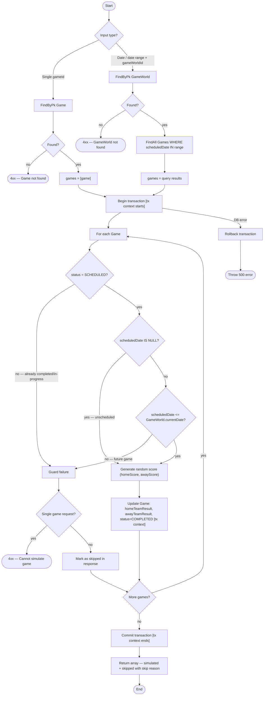
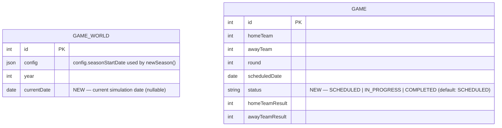

# Use Case Design: Simulate a Game

## Step 1 — Use Case Summary

The player triggers simulation of one or more scheduled games (by game ID, date, or date range). Each game that hasn't been played yet — and whose scheduled date is on or before the current game world date (or has no scheduled date) — gets a random score recorded, and the updated results are returned.

### Player-Provided Clarifications

1. **Trigger**: Player-initiated. Can simulate a single game, all games on a given day, or all games across a date range (e.g. a week of games).

2. **Preconditions**:
   - Game must have `status = SCHEDULED`.
   - If the game has a `scheduledDate`, it must be ≤ the current `GameWorld.currentDate` (backfilling missed days is allowed; future games are blocked). Games with no `scheduledDate` (unscheduled) bypass the date guard and can always be simulated.
   - **Single game**: guard failures return a custom `4xx` error.
   - **Batch**: guard failures are skipped; all requested games (simulated and skipped) are returned in the response with their outcome noted.

3. **Simulation logic**: Random score for now. Long-term will factor in team/player stats, form, coaching, home advantage, etc. — but out of scope for this iteration.

4. **Output**: The game result (homeTeamResult, awayTeamResult) for each simulated game. Richer per-game stats are a future use case.

### Design Note: `GameWorld.currentDate`

**Rule (resolved):** The date guard uses `scheduledDate <= currentDate`, not strict equality. Strict equality would permanently block a player who misses a day; backfilling is the more playable choice. The invariant enforced is "no future games" — which `<=` preserves.

**New field required:** `GameWorld` currently only tracks `year`. This use case requires adding a `currentDate` (full date) field to `GameWorld`. Captured as a data model change in Step 3. This field also unlocks a future "advance date" player action.

**Date advancement:** `GameWorld.currentDate` is **not** auto-advanced after simulation. Advancing time is a separate player action. This keeps simulate focused and gives the player explicit control over progression.

---

## Step 2 — BPMN Process Flow

Existing flows referenced:
- [`record-game-result.md`](../process-flow/record-game-result.md) — reused for the write step
- [`find-game-world.md`](../process-flow/find-game-world.md) — needed to fetch `currentDate` for the date guard

### Flow Notes

- **Two entry points**: single `gameId` or a date/range + `gameWorldId`. The date path requires fetching `GameWorld` to get `currentDate`.
- **Unscheduled games**: if `scheduledDate IS NULL` the date guard is bypassed — unscheduled games can always be simulated. End-of-season guardrails for unscheduled games are a future concern.
- **Guard failure behaviour differs by mode**: single-game → `4xx` error; batch → skip with reason included in response.
- **Transaction context**: the transaction object is passed to every ORM call between "Begin transaction" and "Commit transaction" — labelled `[tx context]` in the diagram. DB errors trigger a full rollback.
- **Return shape**: array of results for both single and batch so the API contract is uniform. Each entry includes either the updated game or the skip reason.
- **Date advancement**: `GameWorld.currentDate` is not modified by this flow — advancing time is a separate player action.

### Open Questions — Resolved

1. **Single-game guard failure** → Custom `4xx` error. Incorporated into BPMN.
2. **Batch response shape** → All requested games returned; skipped games include skip reason. Incorporated into BPMN.
3. **Date advancement** → Separate player action. `GameWorld.currentDate` is not modified by this flow.

### External Review — Resolved

- **The "Unscheduled" Case** — Unscheduled games (`scheduledDate IS NULL`) bypass the date guard and can always be simulated. End-of-season guardrails for unscheduled games are deferred. Incorporated into BPMN.

- **Domain Responsibility** — `SimulationEngine` / `GameFactory.simulate()` is the right abstraction for isolating random score logic. Deferred to low-level design phase (future skill). Noted for that work.

- **Consistency (Transaction Context)** — Yes, this makes sense. `[tx context]` labels added to the BPMN on all ORM calls inside the transaction boundary.

- **Validation (Season Complete side effects)** — Standings are calculated on the fly (`DivisionFactory.getStandings`), so no immediate change needed. Season Complete checks triggered by simulation completing a division's schedule is a future use case to design separately.

- **Conflicting date guard (`=` vs `<=`)** — Resolved in favour of `<=` (backfill allowed). Strict equality is too punishing; the key invariant is "no future games," which `<=` preserves while allowing catch-up. Wording updated throughout.

---

## Step 3 — Access Patterns & Data Model Requirements

### Access Patterns Table

| Step | Operation | Entity | Filter / Key | New? |
|------|-----------|--------|-------------|------|
| Fetch game (single path) | READ | Game | `id = gameId` | **Yes** — no fetch-before-update exists today |
| Guard: status = SCHEDULED | READ (inline) | Game | `status` field | **Yes** — field doesn't exist; currently a blind update |
| Fetch GameWorld (batch + date guard) | READ | GameWorld | `id = gwId` | No — `GameWorldFactory(id).find()` covers this |
| Guard: scheduledDate ≤ currentDate | READ (inline) | GameWorld | `currentDate` field | **Yes** — field doesn't exist |
| Fetch games by date range (batch path) | READ | Game (via joins) | `scheduledDate BETWEEN start AND end`, scoped to `gwId` via League chain | **Yes** — multi-join query, not implemented |
| Update game result + status | WRITE | Game | `id = gameId` | Partial — `GameFactory.result()` exists but doesn't set `status` |

### Data Model Changes

#### 1. `Game` — add `status`

Formalises the "not yet played" guard with an explicit, extensible status enum.

- Type: `ENUM('SCHEDULED', 'IN_PROGRESS', 'COMPLETED')`
- Default: `'SCHEDULED'`
- `IN_PROGRESS` reserved for future in-game management actions
- Set to `'COMPLETED'` by the simulate flow on success

#### 2. `GameWorld` — add `currentDate`

Tracks the current simulation date within the active season for the date guard.

- Type: `DATEONLY`
- Nullable: yes
- **Initialisation:** `newSeason()` must set `currentDate` to the GameWorld's configured season start date when advancing the year. The season start date should be stored in `GameWorld.config` (e.g. `config.seasonStartDate`). This is a cross-use-case impact on the `newSeason` flow — flagged for that flow's design work.

#### ER diagram (new fields only)

#### New index

`Game.scheduledDate` — supports efficient date-range queries in the batch path, which joins Game ← DivisionSeasonGame ← DivisionSeason ← Division ← League filtered by `gameWorldId`.

### New API Endpoint

| Method | Path | Body | Purpose |
|--------|------|------|---------|
| `POST` | `/api/gameWorld/:gwId/simulate` | `{ endDate?: string }` | Simulate all `SCHEDULED` games with `scheduledDate ≤ currentDate` (or `≤ endDate` if provided) |

The existing `POST /api/game/:gameId/simulate` is kept for single-game simulation.

### Implementation Gaps (not schema — flagged for build work)

- `router.ts:87` — passes `req.params.gwId` instead of `req.params.gameId` (bug)
- `GameFactory.result()` — needs fetch-before-update, `status` guard, and `status = COMPLETED` on success
- `GameFactory` — needs a new method to fetch games by date range scoped to a `gameWorldId` (multi-join)
- `newSeason()` — must be updated to set `GameWorld.currentDate` from `config.seasonStartDate`

---

## Step 4 — Gherkin Test Cases

Generated and saved to [`docs/architecture/test-cases/simulate-game.feature`](../test-cases/simulate-game.feature).

Scenarios covered:

| Category | Count |
|----------|-------|
| Single game — happy paths | 3 |
| Single game — guard failures | 5 |
| Batch — happy paths | 3 |
| Batch — skip behaviour | 3 |
| Batch — boundary conditions | 4 |
| Data integrity / rollback | 2 |
| Status transitions | 2 |
| **Total** | **22** |

---

### Step 3 Open Questions — Resolved

1. **`status` enum values** → `SCHEDULED`, `IN_PROGRESS`, `COMPLETED`. No `CANCELLED` for now.
2. **`currentDate` initialisation** → Set by `newSeason()` from `GameWorld.config.seasonStartDate`. Not set manually by the player.
3. **Batch endpoint shape** → `POST /api/gameWorld/:gwId/simulate` with optional `endDate`. Approved.