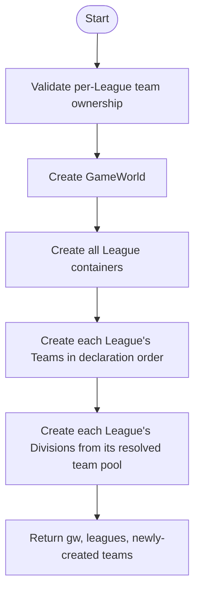

# Create Game World

```mermaid
flowchart TD
  start([Start]) --> validate[Validate per-League team ownership]
  validate --> gw[Create GameWorld]
  gw --> lcreate[Create all League containers]
  lcreate --> tcreate[Create each League's Teams in declaration order]
  tcreate --> dcreate[Create each League's Divisions from its resolved team pool]
  dcreate --> lend[Return gw, leagues, newly-created teams]

  click tcreate "create-team.md" "Open Create Team flow"
  click lcreate "create-league.md" "Open Create League flow"
```
