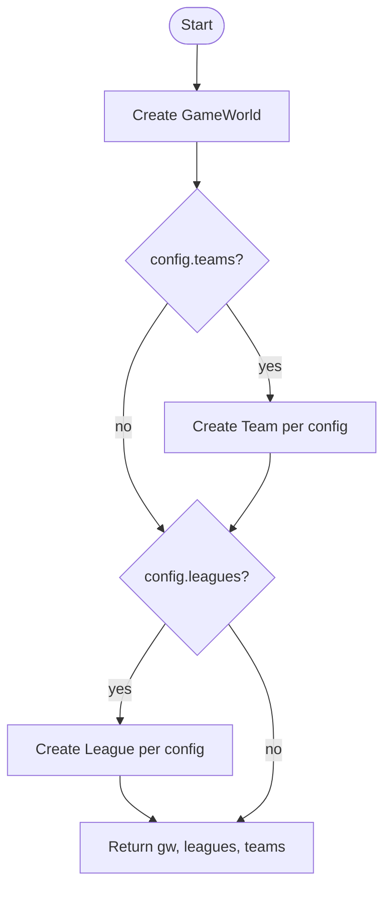

# Create Game World

```mermaid
flowchart TD
  start([Start]) --> gw[Create GameWorld]
  gw --> teams{config.teams?}
  teams -->|yes| tcreate[Create Team per config]
  teams -->|no| leagues
  tcreate --> leagues{config.leagues?}
  leagues -->|yes| lcreate[Create League per config]
  lcreate --> lend[Return gw, leagues, teams]
  leagues -->|no| lend

  click tcreate "create-team.md" "Open Create Team flow"
  click lcreate "create-league.md" "Open Create League flow"
```
