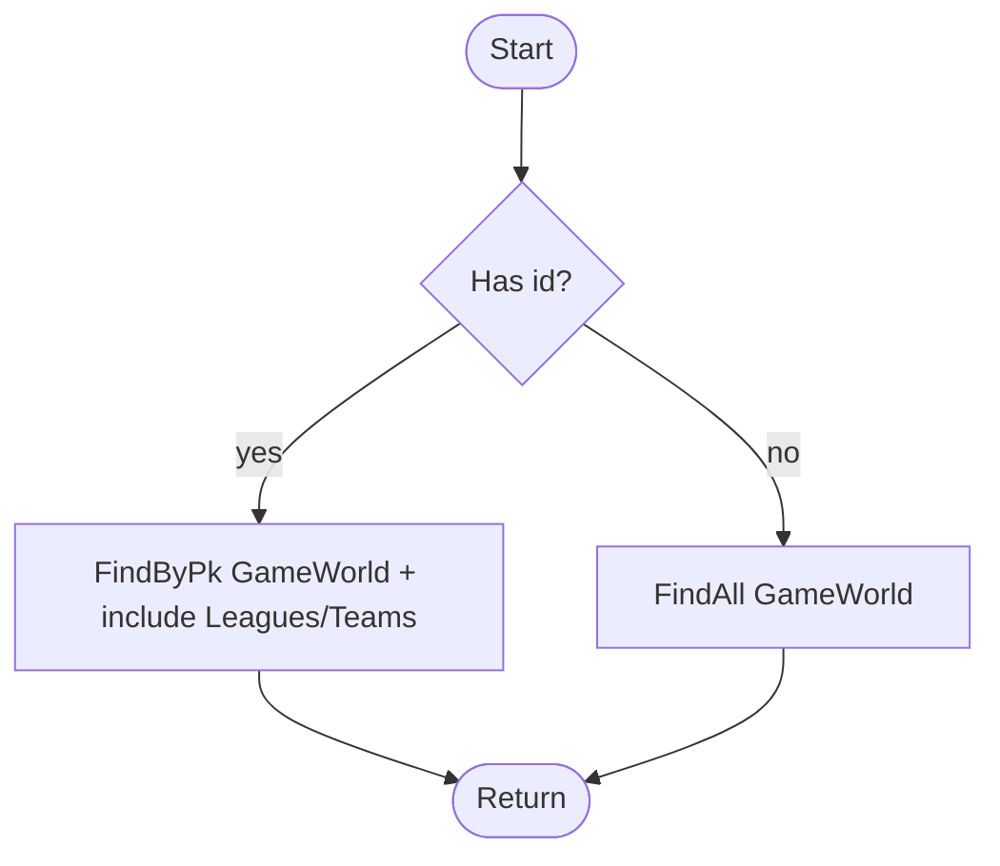

# Find Game World

```mermaid
flowchart TD
  start([Start]) --> hasId{Has id?}
  hasId -->|yes| findPk[FindByPk GameWorld + include Leagues/Teams]
  hasId -->|no| findAll[FindAll GameWorld]
  findPk --> endNode([Return])
  findAll --> endNode
```
