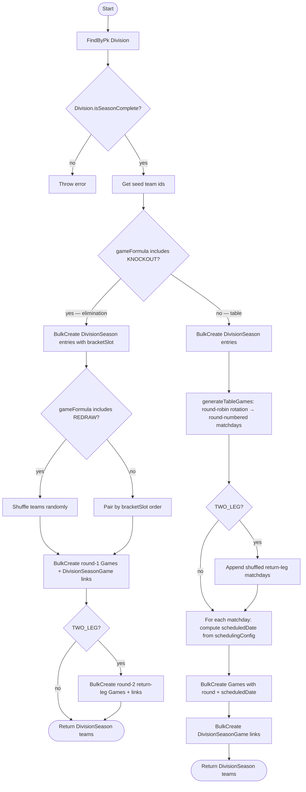

# Start New Season (Division)

Notes
- `scheduledDate = startDate + (round - 1) × intervalDays` when `schedulingConfig` is present; omitted otherwise.
- `bracketSlot` is only populated for elimination divisions; it preserves seeding for fixed-bracket advancement in `advanceRound()`.
- TWO_LEG elimination creates both legs at season start (round 1 = first legs, round 2 = return legs). TWO_LEG table appends a shuffled second set of matchdays.
