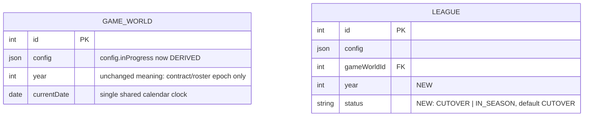

# LLD: Season Calendar Lifecycle

> EARS: `docs/specs/season-calendar-lifecycle-specs.md` (`SCL-001`…`SCL-017`) ·
> Gherkin: `test/bdd/features/season-calendar-lifecycle.feature` (all scenarios bound in #124)
> Origin: issue #114, settled via `/grill-me`

> Implementation: `SCL-006` and `SCL-007` are delivered by issue #119.

## Scope

Fixes the root problem behind #114: `GameWorld.currentDate` is never initialized by any
existing code path (`GameWorldFactory.create`/`newSeason` never touch it; only
`advanceCurrentDate`, called solely by `rapidSimulateSeason`, sets it — and that requires it to
already be non-null via `simulateBatch`'s guard). This leaves "Simulate Today" permanently
disabled and rapid-simulate permanently 422 on any freshly created or rolled-over `GameWorld`.

Investigation surfaced that `Game.scheduledDate` assignment is **already implemented** —
`DivisionFactory` (`src/db/domain/division.ts`) already computes `scheduledDate` from a
per-`DivisionConfig` `SchedulingConfig { startDate, intervalDays }` for round-robin matchdays,
knockout rounds, byes, and two-leg return fixtures. That part of the original issue text is
stale relative to current code and is *not* re-designed here.

What *is* newly designed, because grilling surfaced it wasn't scoped correctly in the issue as
written:

- **Season lifecycle (year + CUTOVER/IN_SEASON status) moves from `GameWorld` to `League`.**
  Different Leagues in one GameWorld can run on different real-world calendars (MLS Feb–Nov vs.
  a UEFA-style Aug–May league; a team can play in both, per the Nordic-team/Champions-League
  case). A single GameWorld-wide season year/status cannot represent that.
- **`GameWorld.currentDate` stays a single, GameWorld-wide value** — there is only one calendar
  clock, even if multiple Leagues are in different lifecycle phases against it.
- A rollover is split into two explicit League-scoped actions — `cutover()` then `start()` —
  with a real off-season gap between them, because rollover isn't just "pick the next date," it's
  a window where other game actions (trades, contract renewals, promotion/relegation) can happen
  before the next season's fixtures are generated.

Out of scope (explicitly deferred, not silently dropped):
- Off-season actions themselves (trades, promotion/relegation, contract renewal flows) — this
  design only carves out the CUTOVER phase as the window they'll eventually plug into.
- Propagating `League.year` into contract/roster logic (`team.ts`'s `generateRoster` /
  `gameWorldYear`) — contracts derive their *dates* from season info but aren't rigidly keyed to
  a shared year integer; `GameWorld.year` keeps its current meaning there unchanged. Flagged as a
  known, pre-existing inconsistency for a team whose League has diverged from `GameWorld.year`,
  not introduced by this change.
- A `PATCH /api/division/:divisionId/config` endpoint's full field surface — only
  `schedulingConfig` is in scope; broader division-config editing is future work.

## Rejected Alternatives

| # | Alternative | Rejected because |
|---|---|---|
| A | Single GameWorld-level `startDate` as the source of truth | Duplicates the config surface `SchedulingConfig` already provides per-Division; loses legitimate staggered-start flexibility. |
| B | Collapse per-division `startDate` into one shared League/GameWorld value | Same reason as A, plus doesn't fit the per-League calendar discovery at all. |
| C | Require every Division to configure `schedulingConfig` (no partial dating) | Breaks existing backward-compatible behavior where an unconfigured Division simply never gets `scheduledDate`s. |
| D | Auto-compute next season's `startDate` as `currentDate + fixed offsetDays` at rollover | Doesn't allow for a real, indeterminate-length off-season where other actions occur — replaced by an explicit CUTOVER phase. |
| E | `season/start` takes an explicit `startDate` override parameter | Introduces a second, parallel channel for the same information; per-Division `schedulingConfig` (editable during CUTOVER) stays the single source of truth instead. |
| F | Keep season year/status at `GameWorld` level | Cannot represent two Leagues in different phases/years at once (MLS vs. UEFA-style calendars in the same GameWorld). |
| G | Propagate `League.year` into contract/roster logic now | Scope creep — contracts are date-derived from season info, not year-keyed; left as a flagged follow-up. |
| H | `TeamSeasonCalendar` keeps one top-level `year` (null when ambiguous) | Confusing, and doesn't serve the actual requirement (disambiguating repeat fixtures across seasons, querying by league). Replaced with per-game `year`. |
| I | Backfill all existing Leagues to `CUTOVER` unconditionally | Needlessly breaks already-mid-season dev/test GameWorlds; replaced with inference from existing `DivisionSeason` rows. |
| J | Keep `GameWorld.config.inProgress` as an independent manually-set flag | Two sources of truth that can drift; replaced with a value derived from `League.status` on every transition. |

## Data Model Changes



| Change | Rationale |
|---|---|
| `League.year: INTEGER` | Source of truth for that League's own season year; `DivisionSeason.year` is sourced from here, not `GameWorld.year`. |
| `League.status: ENUM('CUTOVER','IN_SEASON')`, default `'CUTOVER'` | Per-League lifecycle phase — replaces the GameWorld-wide `config.inProgress` as the *real* signal; `config.inProgress` becomes a derived convenience field (see SCL-008). |
| `GameWorld.year`, `GameWorld.config.inProgress` | Unchanged column definitions. `year`'s meaning is left alone (contract/roster epoch, `team.ts`/`player.ts`). `config.inProgress`'s *value* becomes derived (see below) but its shape/consumers (`AppHeader.canBatch`) don't change. |

### Schema rollout

The idempotent League schema migration adds `year` and `status` to an existing
`Leagues` table, then backfills every League's `year` from its parent
`GameWorld.year`. It derives `status` from history rather than assuming a clean
slate: a League is `IN_SEASON` when any `DivisionSeason` belongs to one of its
Divisions (regardless of that row's year), and is otherwise `CUTOVER`. New
tables receive the model defaults directly.

## Interface

```ts
// src/db/domain/league.ts
interface ILeague {
  // ...existing members unchanged (get, isSeasonComplete, getBracket, getStandings, create)...
  cutover: () => Promise<{ id: number; year: number; status: 'CUTOVER' }>;   // NEW, replaces newSeason()
  start: () => Promise<{ id: number; year: number; status: 'IN_SEASON' }>;   // NEW, replaces newSeason()
}
```

```ts
// src/api/endpoints.ts
LeagueSeasonCutover = '/api/league/:leagueId/season/cutover'   // NEW
LeagueSeasonStart = '/api/league/:leagueId/season/start'       // NEW
UpdateDivisionSchedulingConfig = '/api/division/:divisionId/config'   // NEW, PATCH, schedulingConfig only
// NewSeason = '/api/gameWorld/:gwId/season/new'   // REMOVED — replaced by the two above
```

`PATCH /api/division/:divisionId/config` accepts `{ schedulingConfig: SchedulingConfig }`.
It loads the Division with its parent League, rejects a missing Division with 404, and rejects
an `IN_SEASON` parent League with 422. On success it replaces only
`Division.config.schedulingConfig`; every other key in the existing config JSON remains intact.
No general DivisionConfig editing surface is introduced.

### HTTP lifecycle actions

`POST /api/league/:leagueId/season/cutover` delegates only to
`LeagueFactory(Number(leagueId)).cutover()`. `POST /api/league/:leagueId/season/start`
similarly delegates only to `start()`. Both routes send the returned lifecycle payload and use
the router's standard error boundary, preserving a domain error's `statusCode` in the HTTP
response. The prior GameWorld-scoped `/season/new` route and API handler are absent: a caller
must choose the League and lifecycle transition explicitly.

```ts
// src/api/models.ts — TeamSeasonGame gains `year`; TeamSeasonCalendar drops top-level `year`
interface TeamSeasonGame {
  // ...existing fields unchanged...
  year: number;   // NEW — sourced from this game's DivisionSeason's League.year
}
interface TeamSeasonCalendar {
  teamId: number;
  teamName: string;
  // year: number;   // REMOVED — no single answer once Leagues diverge
  games: TeamSeasonGame[];
}
```

## Logic Flow

```
LeagueFactory(id).cutover():
1. Load League by id (404 if missing).                                             # SCL-002
2. IF league.status !== 'IN_SEASON': reject 422 ("league is not in season").        # SCL-002
3. IF !isSeasonComplete(league.year) (existing per-Division aggregation,
   src/db/domain/league.ts:24): reject 422 ("season is not complete").             # SCL-002
4. league.year += 1; league.status = 'CUTOVER'                                     # SCL-002
5. Recompute GameWorld.config.inProgress (see below).                              # SCL-008
6. Return { id, year, status }.

  Note: for a brand-new League that has never played, step 3's isSeasonComplete
  already returns true when there are zero DivisionSeason rows (existing
  behavior, division.ts:40) — no special-casing needed for "first ever season."
  A brand-new League still starts life in CUTOVER (set at LeagueFactory.create,
  SCL-001), so its first-ever start() is exactly the same call as every later one.

LeagueFactory(id).start():
1. Load League + its Divisions (404 if missing).                                   # SCL-003
2. IF league.status !== 'CUTOVER': reject 422 ("league is not in cutover").         # SCL-003
3. Load parent GameWorld's currentDate.
4. FOR EACH division with a configured schedulingConfig:
     IF gameWorld.currentDate != null AND schedulingConfig.startDate <=
        gameWorld.currentDate:
       reject 422 identifying the offending division; generate nothing.            # SCL-004
   (Divisions without schedulingConfig are skipped entirely — no check, no dates,
   same as always.)                                                                # SCL-006 (inv)
5. FOR EACH division: DivisionFactory(divisionId).newSeason(league.year) —
   reuses existing generation logic unchanged (round-robin/knockout/byes/two-leg),
   but now takes league.year directly as the season year being generated (already
   incremented by the prior cutover()), not GameWorld.year-derived. All generation
   writes and the status transition occur in one transaction, so a generation error
   leaves every Division and the League unchanged.                                  # SCL-005,SCL-009
6. league.status = 'IN_SEASON'                                                      # SCL-005
7. Recompute GameWorld.config.inProgress.                                           # SCL-008
8. IF gameWorld.currentDate == null:
     candidates = MIN(schedulingConfig.startDate) across this league's configured
     divisions only (unconfigured divisions never contribute)
     IF candidates is non-empty: GameWorld.currentDate = candidates             # SCL-006
     ELSE: leave null
   ELSE: leave currentDate unchanged (already guaranteed <= every new startDate
   by step 4's validation).                                                        # SCL-007
9. Return { id, year, status }.

Recompute GameWorld.config.inProgress (called from both cutover() and start()):
  inProgress = EXISTS a sibling League under the same GameWorld with status === 'IN_SEASON'
  GameWorld.update({ config: { ...config, inProgress } })                          # SCL-008

PATCH /api/division/:divisionId/config:
1. Load the Division with its parent League (404 if the Division is missing).
2. IF parent League.status !== 'CUTOVER': reject 422; do not update Division.config. # SCL-017
3. Replace only `Division.config.schedulingConfig` with request.schedulingConfig and persist
   the resulting config JSON.                                                       # SCL-017

TeamFactory(id).getSchedule(gwId, leagueId?) [MODIFIED]:
  - Drop the `gameWorld.year` lookup for query purposes.
  - For each DivisionSeason candidate (still filtered by `leagueId` when given),
    resolve `year` from that DivisionSeason's own Division → League.year, and
    query DivisionSeason.year against THAT value (not one shared year) per league. # SCL-010
  - Response: build each TeamSeasonGame with `year` from its DivisionSeason;
    drop the top-level `year` field.                                               # SCL-011
```

### #118 implementation note

`DivisionFactory.newSeason()` retains its existing one-argument compatibility mode,
where callers provide a completed year and the factory creates the following year.
`LeagueFactory.start()` supplies an explicit target season year of `League.year` so
the new League lifecycle does not inherit that legacy `+1` convention or read
`GameWorld.year`. The round-robin, knockout, bye, and two-leg generation branches
remain the same after the target year is resolved.

## Edge Case Probe

| # | Condition | Handling | Spec |
|---|---|---|---|
| e1 | `cutover()` called while League is already `CUTOVER` | Rejected 422 — status must be `IN_SEASON` to cut over. | SCL-002 |
| e2 | `cutover()` called while a Division's season isn't complete | Rejected 422, same precondition `LeagueFactory.newSeason` enforced today, unchanged. | SCL-002 |
| e3 | `start()` called while League is already `IN_SEASON` | Rejected 422 — status must be `CUTOVER`. | SCL-003 |
| e4 | `start()` called with a configured Division whose `schedulingConfig.startDate` is on/before the live `GameWorld.currentDate` | Rejected 422 identifying the Division; nothing generated, no partial state. | SCL-004 |
| e4a | A Division fails while `start()` is generating seasons after validation succeeds | The transaction rolls back all DivisionSeason/Game rows and preserves `CUTOVER`, so retrying does not encounter partial seasons. | SCL-005 |
| e5 | `start()` on the very first League ever started in a GameWorld (`currentDate` still `null`) | No lower-bound check (nothing to be after yet); `currentDate` gets set from this call's own MIN. | SCL-004, SCL-006 |
| e6 | `start()` on a League whose Divisions all lack `schedulingConfig` | No validation applies, games generate with no `scheduledDate` (existing behavior), `currentDate` untouched if already set, stays `null` if this was the only/first League to start. | SCL-006 |
| e7 | Two Leagues in one GameWorld, one `IN_SEASON` one `CUTOVER` | `GameWorld.config.inProgress` is `true` (derived: at least one `IN_SEASON`); `simulateBatch`/`rapidSimulateSeason` still walk all Leagues — the `CUTOVER` one simply has zero reachable non-completed games since its `Division.newSeason()` for the new year hasn't run. | SCL-008, SCL-013 |
| e8 | All Leagues `CUTOVER` simultaneously | `GameWorld.config.inProgress` derives to `false`; "Simulate Today" disabled via existing `canBatch` shape, unchanged. | SCL-008, SCL-014 |
| e9 | A Team plays in two Leagues whose `year` has diverged (e.g. MLS 2028, UEFA-style League 2027) | `getSchedule` resolves each League's own `year` per Division; response's per-game `year` disambiguates identical-opponent fixtures across the two Leagues' different seasons. | SCL-010, SCL-011 |
| e10 | Migration: existing League has `DivisionSeason` rows already (any year) | Backfills `year = GameWorld.year`, `status = 'IN_SEASON'`. | SCL-012 |
| e11 | Migration: existing League has zero `DivisionSeason` rows | Backfills `year = GameWorld.year`, `status = 'CUTOVER'`. | SCL-012 |
| e12 | Migration: an existing League's only season is already fully complete | Backfills to `IN_SEASON` per e10 (simplification: presence, not completion, drives the inference) — operator can immediately call `cutover()` to correct it; not silently stuck wrong. | SCL-012 |
| e13 | `PATCH /api/division/:divisionId/config` (schedulingConfig) attempted while parent League is `IN_SEASON` | Rejected 422 and retain the exact existing config — scheduling config is only editable during `CUTOVER`. | SCL-017 |
| e14 | A CUTOVER League updates a Division config containing format, teams, or other fields | Replace only `schedulingConfig`; retain all other keys verbatim. | SCL-017 |

## Traceability

| Layer | Artifact |
|---|---|
| **This LLD** | `docs/llds/season-calendar-lifecycle.md` |
| EARS | `docs/specs/season-calendar-lifecycle-specs.md` — `SCL-001`…`SCL-017` |
| Gherkin | `test/bdd/features/season-calendar-lifecycle.feature` (new) |
| Code | `src/db/model/league.ts` and `src/db/migrations/league-year-status.ts` (League lifecycle schema/backfill), `src/db/domain/league.ts` (`cutover`/`start` and derived `config.inProgress`), `src/db/domain/division.ts` (CUTOVER-gated scheduling config update), `src/db/domain/team.ts` (per-League `getSchedule` years), `src/db/domain/game.ts` (all-League batch reachability), `src/db/domain/game-world.ts`, `src/index.ts`, `src/api/models.ts` (`TeamSeasonGame`/`TeamSeasonCalendar`), `src/api/endpoints.ts`, `src/api/handlers.ts`, `src/api/router.ts`, and `src/ui/components/batch-simulate-control.tsx` (unchanged `canBatch` guard after the AppHeader relocation) |
